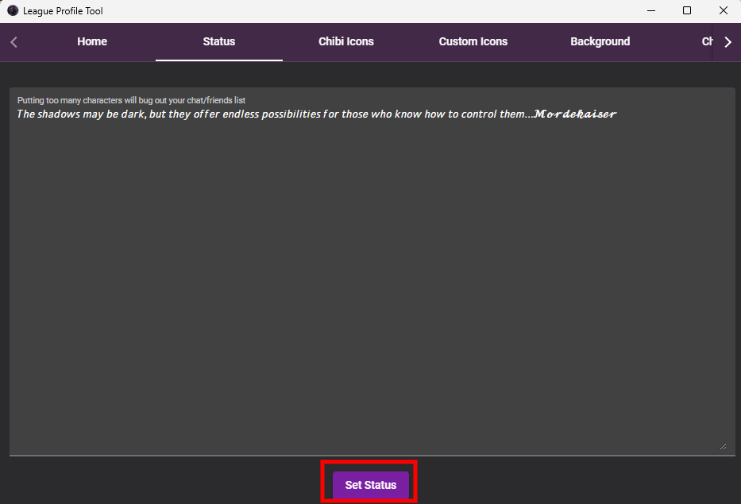

[Return to Home](../README.md)

# League-profile-tool Installation Guide

Welcome to the League-profile-tool installation guide! Spice up your League of Legends profile with customized profile statuses using these simple steps:

1. **Install League-profile-tool**  
    1. Download the newest version of League-profile-tool from the [official repository](https://github.com/MManoah/league-profile-tool)

    2. Unzip the downloaded folder `League.Profile.Tool.zip` located in `C:\Users\{UserName}\Downloads`

2. **Add Custom Profile Status** 
    1. Open the `League Profile Tool.exe` located in `C:\Users\{UserName}\Downloads\League.Profile.Tool\League Profile Tool`

    2. Navigate to the "Status" tab in the navigation

    3. Copy and paste the text from the File [status.txt](./status.txt) located in '`~\backups\leagueProfileTool`' into the status field

    4. Save the custom status using the "Set Status" button

### League-profile-tool is now successfully installed and configured!   ʕ⁠っ⁠•⁠ᴥ⁠•⁠ʔ⁠っ

---

##### Need Visual Assistance?

If you need visual guidance, check out these helpful screenshots:

    
Navigate to Status

    

    
Save Custom Status

    

