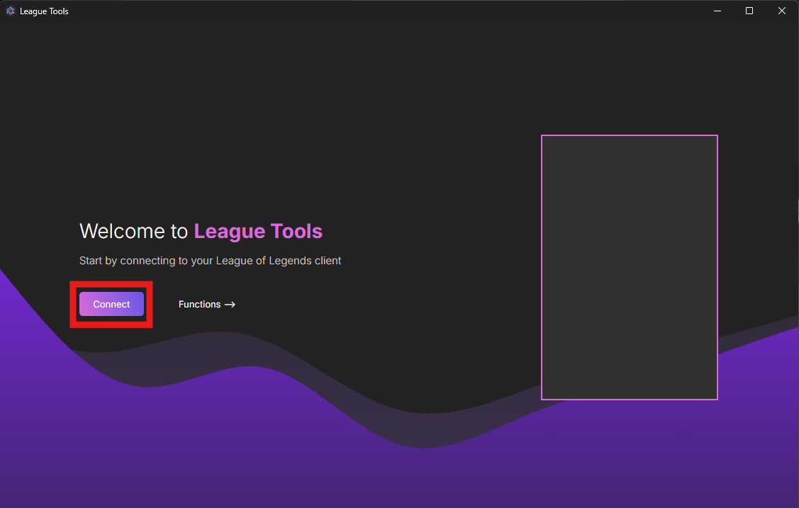
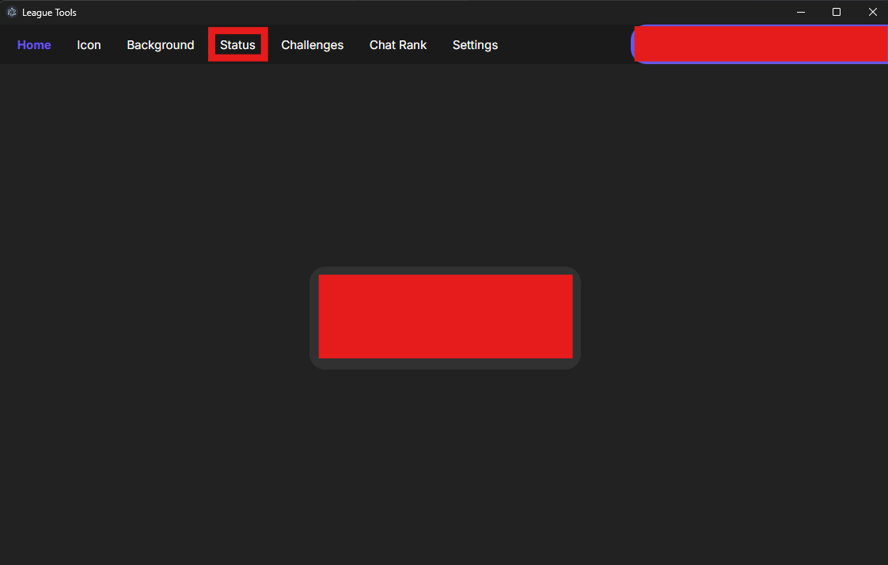
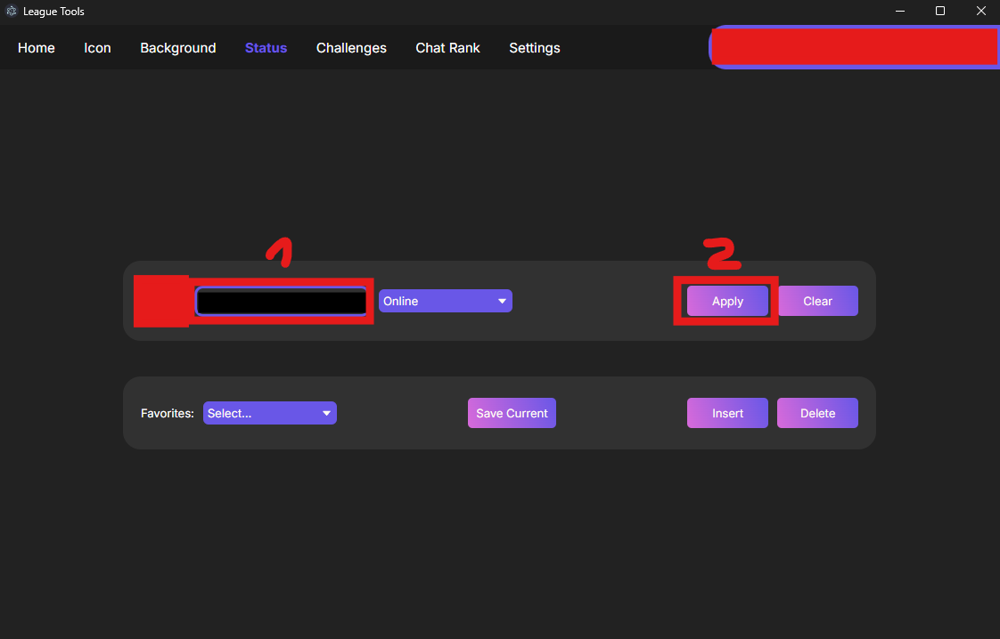

[Return to Home](../README.md)

# League-tools Installation Guide

Welcome to the League-tools installation guide! Spice up your League of Legends profile with customized profile statuses using these simple steps:

1. **Install League-tools**  

   1. Download the newest version of League-tools from the [official repository](<[https://github.com/MManoah/league-profile-tool](https://github.com/7rebux/league-tools)>)

   2. Unzip the downloaded folder `league-tools-{version}-win32-x64.zip` located in `C:\Users\{UserName}\Downloads`

2. **Add Custom Profile Status**

   1. Open the `league-tools.exe` as administrator located in `C:\Users\{UserName}\Downloads\league-tools-{version}-win32-x64\league-tools-win32-x64`

   2. Navigate to the "Status" tab in the navigation

   3. Copy and paste the text from the File [status.txt](./status.txt) located in '`~\backups\leagueTools`' into the status field

   4. Save the custom status using the "Apply" button

### League-tools is now successfully installed and configured!   ʕ⁠ っ ⁠•⁠ᴥ⁠•⁠ʔ⁠ っ

---

##### Need Visual Assistance?

If you need visual guidance, check out these helpful screenshots:

    
Connect with League

    

    
Navigate to Status

    

    
Save Custom Status

    

