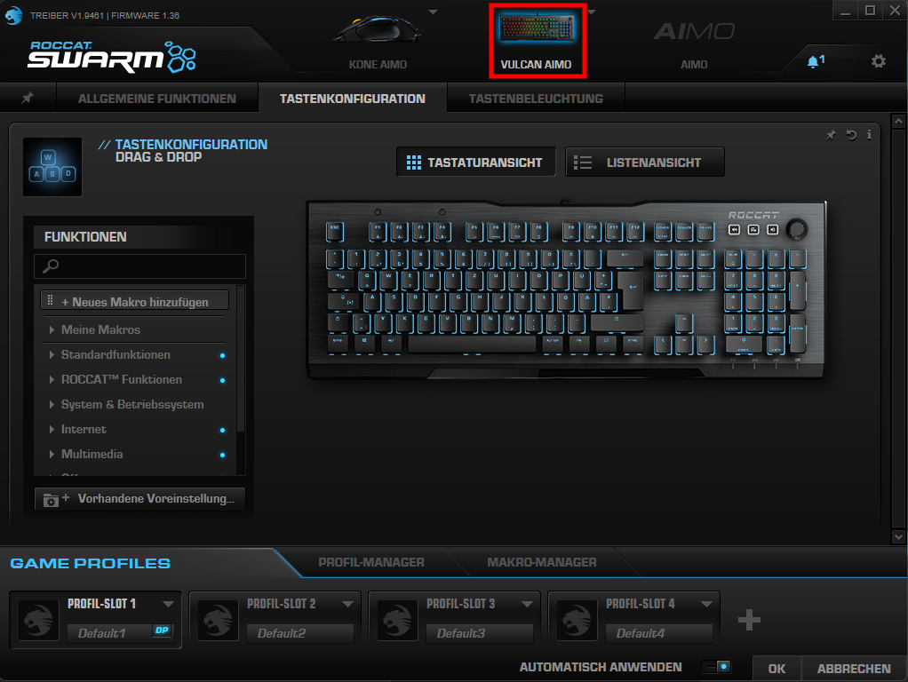
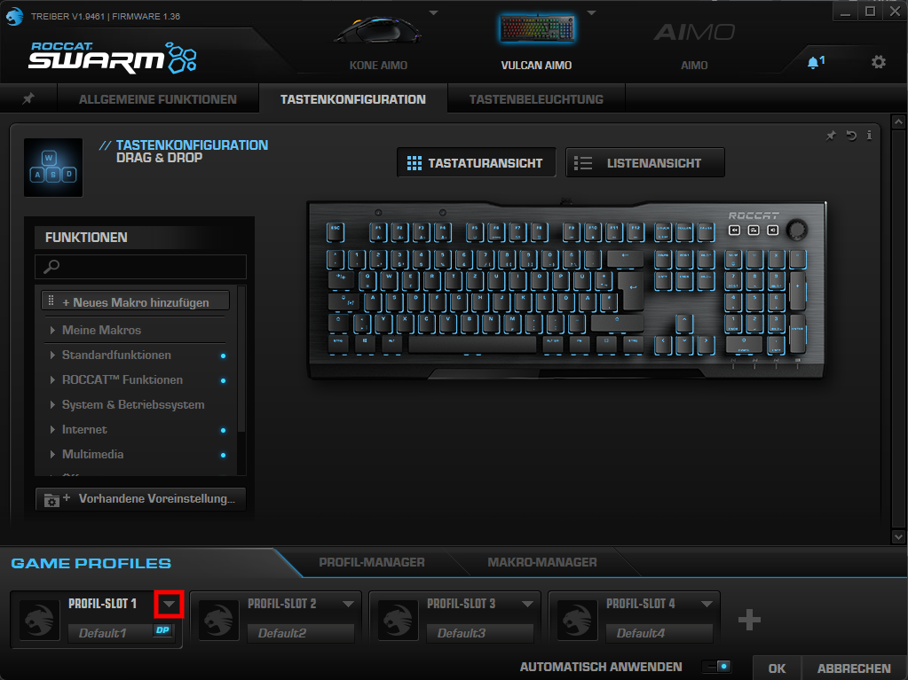
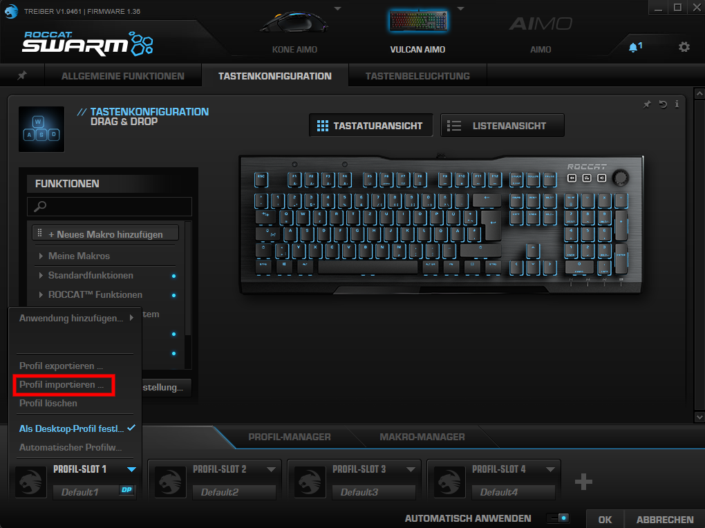
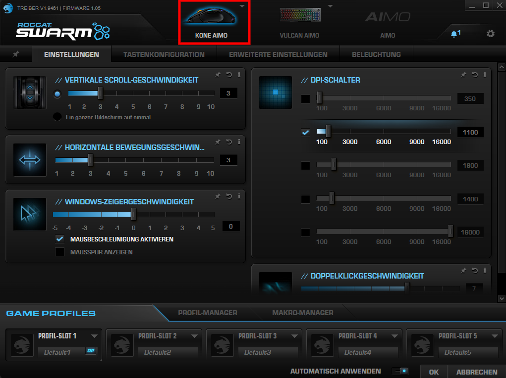
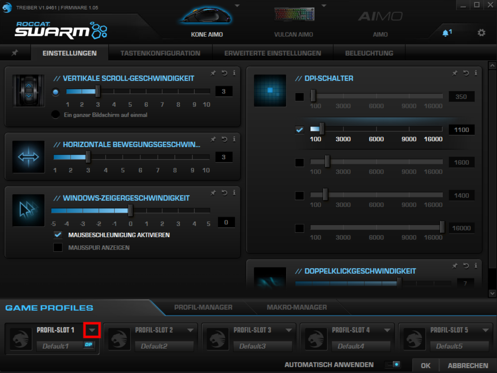
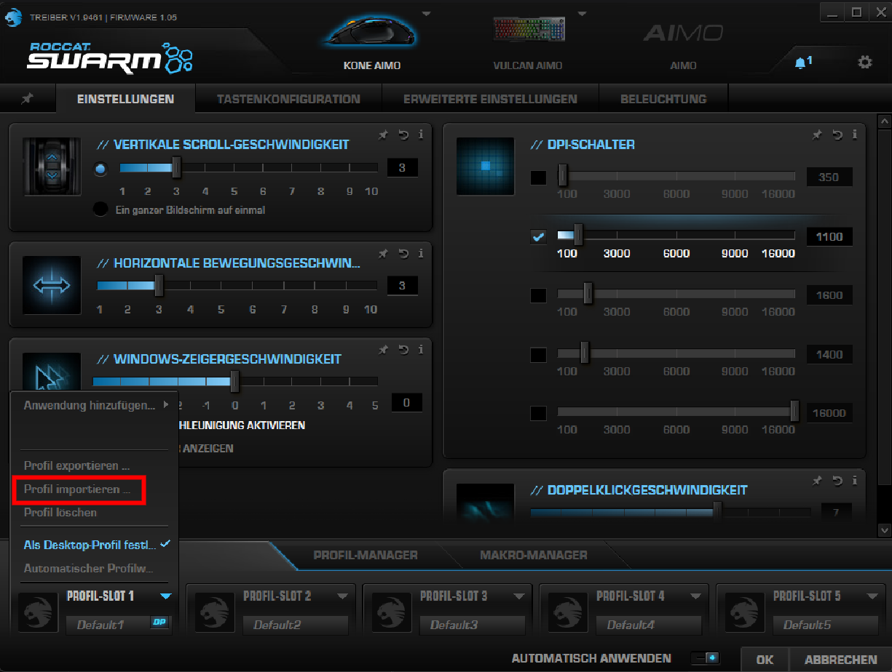

[Return to Home](../README.md)

# Roccat Swarm Installation Guide

Welcome to the Roccat Swarm installation guide!

1. **Install Roccat Swarm**  
    1. Download the newest version of Roccat Swarm from the [official download site](https://support.roccat.com/s/downloads?language=de)

    2. Unzip the downloaded folder `roccat--swarm_{VersionNumber}.zip` located in `C:\Users\{UserName}\Downloads`

    3. Execute the `ROCCAT Swarm_v{VersionNumber}.exe` located in `C:\Users\{UserName}\Downloads\roccat--swarm_{VersionNumber}` and follow the installation steps.

2. **Import Backups** 

    **Keyboard** (Vulcan Aimo):
    1. Open Roccat Swarm and navigate to **VULCAN AIMO**.
    2. On the bottom left in **GAME PROFILES** select the dropdown of **PROFILE-SLOT 1**
    3. Click **Import Profile...** to import the Backup.
    4. Select [vulcanAimo.rkp](./vulcanAimo.rkp) from `~\backups\roccatSwarm`.

    **Mouse** (Kone Aimo):
    1. Open Roccat Swarm and navigate to **KONE AIMO**.
    2. On the bottom left in **GAME PROFILES** select the dropdown of **PROFILE-SLOT 1**
    3. Click **Import Profile...** to import the Backup.
    4. Select [koneAimo.rmp](./koneAimo.rmp) from `~\backups\roccatSwarm`.

### Roccat Swarm is now successfully installed and configured!   ʕ⁠っ⁠•⁠ᴥ⁠•⁠ʔ⁠っ

---

##### Need Visual Assistance?

If you need visual guidance, check out these helpful screenshots:

- **Keyboard** (Vulcan Aimo)
    

        
Open VULCAN AIMO

        
    

    

        
Open Dropdown of PROFILE-SLOT 1

        
    

    

        
Import Profile ...

        
    

- **Mouse** (Kone Aimo)
    

        
Open KONE AIMO

        
    

    

        
Open Dropdown of PROFILE-SLOT 1

        
    

    

        
Import Profile ...

        
    
