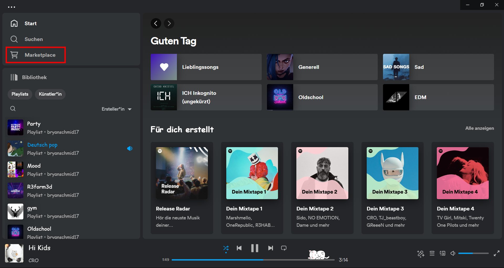
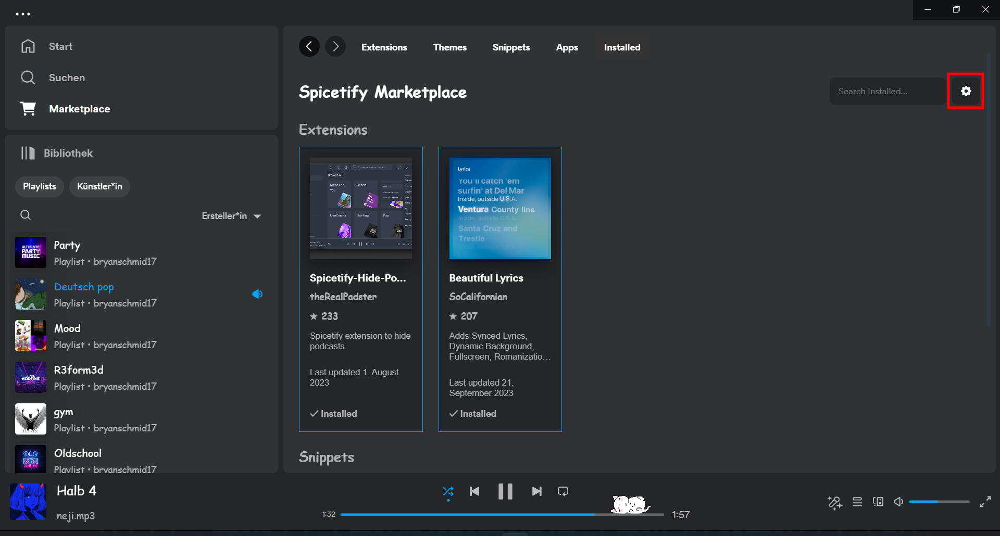
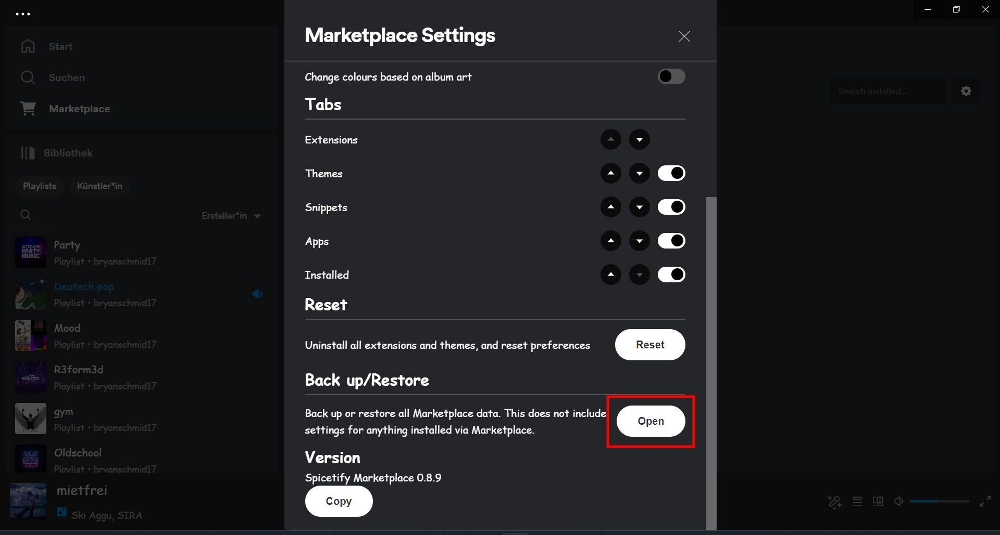
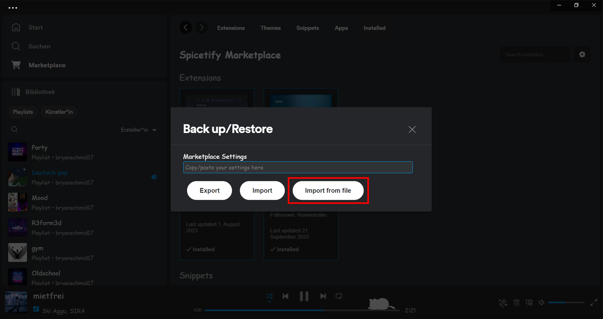

[Return to Home](../README.md)

# Spicetify Installation Guide

Welcome to the Spicetify installation guide! Spice up your Spotify experience with custom themes and extensions using these simple steps:

<details>
    <summary>See the End Result</summary>
    
</details>

1. **Install Spicetify and Marketplace** <br>
    Open your PowerShell and run the following commands:
    ```shell
    iwr -useb https://raw.githubusercontent.com/spicetify/spicetify-cli/master/install.ps1 | iex
    iwr -useb https://raw.githubusercontent.com/spicetify/spicetify-marketplace/main/resources/install.ps1 | iex
    ```

2. **Add Extensions and Themes** 

    1. **Add `flexi.js` Extension:** <br>
        Place [flexi.js](./local/extensions/flexi.js) from `~\backups\spicetify\local\extensions` into `C:\Users\{UserName}\AppData\Local\spicetify\Extensions`.

    2. **Add `FlexiTheme`:** <br>
        Place [FlexiTheme](./roaming/themes/FlexiTheme/README.md) from `~\backups\spicetify\roaming\themes` into `C:\Users\{UserName}\AppData\Roaming\spicetify\Themes`.

3. **Update Configuration** <br>
    Update `config-xpui.ini` located in `C:\Users\{UserName}\AppData\Roaming\spicetify`:

    ```config-xpui.ini
    extensions = flexi.js
    current_theme = FlexiTheme
    ```

4. **Apply changes** <br>
    In your Command Prompt or PowerShell, run:

    ```shell
    spicetify apply
    ```

5. **Restore Marketplace**
    1. Open Spotify and navigate to **Marketplace**.
    2. Open **Marketplace Settings**.
    3. Access **Backup Settings**.
    4. Click **Import from File** to import the Backup.
    5. Select [marketplaceBackup.txt](./marketplaceBackup.txt) from `~\backups\spicetify`.

### Spicetify is now successfully installed and configured! <br> ʕ⁠っ⁠•⁠ᴥ⁠•⁠ʔ⁠っ

---

##### Need Visual Assistance?

If you need visual guidance, check out these helpful screenshots:

<details>
    <summary>Open Marketplace in Spotify</summary>
    
</details>

<details>
    <summary>Open Marketplace Settings</summary>
    
</details>

<details>
    <summary>Access Backup Settings</summary>
    
</details>

<details>
    <summary>Import Marketplace Backup from File</summary>
    
</details>